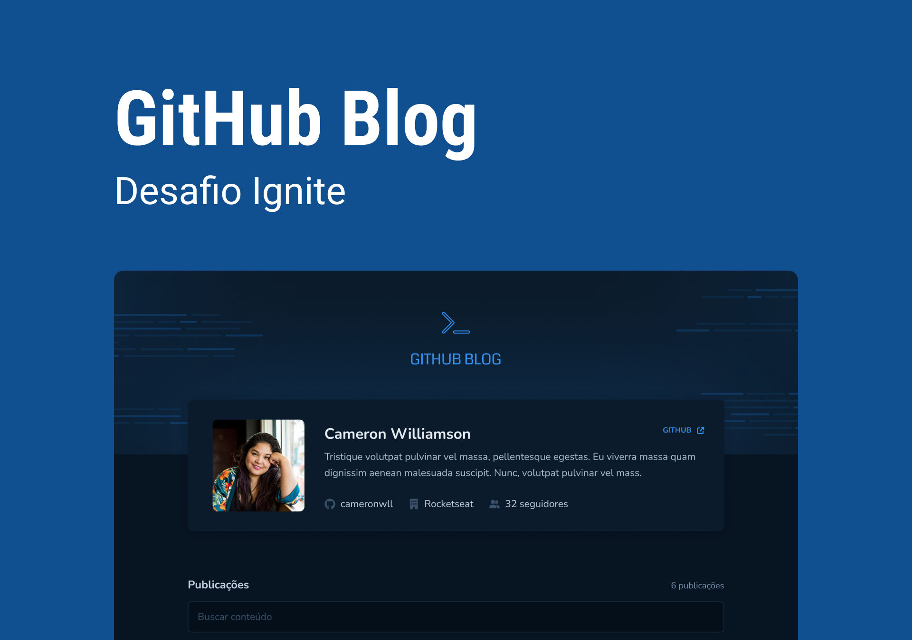

## 📝 Simple GitHub Blog
Welcome to the Simple GitHub Blog! This project was developed to strengthen our React fundamentals and experiment with Markdown rendering in a web application. Additionally, we focused on creating a fully responsive design, so you can enjoy the blog on any device, including mobile.



## 🚀 Project Overview
This project is a simple, yet powerful blog application that pulls content from GitHub and displays it in a clean, reader-friendly format. Posts are formatted in Markdown, which is rendered directly in the app to provide a smooth reading experience.


## 🛠️ Getting Started
Prerequisites
To run this project locally, make sure you have Node.js installed.

Installation
Clone the repository:

```bash

git clone https://github.com/cdfortes/github-blog-project.git
cd simple-github-blog
``` 
Install dependencies:

```bash
npm install
# or
yarn install
```
Start the development server:


```bash
npm start
# or
yarn start
```

The application will open in your default browser at http://localhost:5173/.


## 📝 Usage
View the list of blog posts on the homepage.
Select a post to read its full content, rendered in Markdown format.
Enjoy reading on any device – desktop, tablet, or mobile.


## 📚 Learning Objectives
This project aimed to:

Strengthen React Fundamentals: Practiced state management, component-based architecture, and React Router.
Explore Markdown in React: Implemented Markdown parsing and rendering for web.
Focus on Responsive Design: Developed a fully responsive UI using CSS Flexbox.
🤝 Contributing
Contributions are welcome! If you have any suggestions or find any issues, feel free to open a pull request or issue.

## 📄 License
This project is licensed under the MIT License.